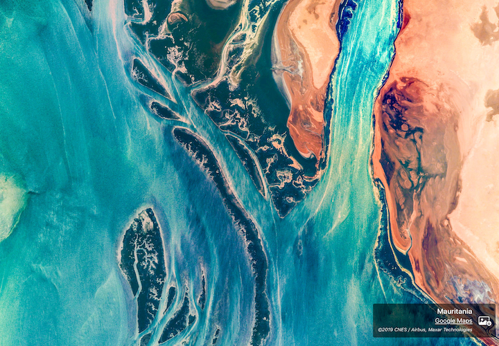

# EarthViewer
Simple iOS and tvOS apps that replicate the behavior of the Earth View [Chrome extension](https://chromewebstore.google.com/detail/earth-view-from-google-ea/bhloflhklmhfpedakmangadcdofhnnoh). Since the standalone website (http://earthview.withgoogle.com) is no longer active this provides a nice way to still browse the images without the extension.

Resource list provided by: https://github.com/alexpersian/earthview

### App Behaviors
* When the app starts a random image will be selected. There are 2604 different images.
* Tapping on the right side of the screen advances to the next image. Tapping on the left side goes to previous image.
* Tapping on the Google Maps link in the Details overlay will open Google Maps to the image's location.
* Tapping on the Save Image icon will save the currently displayed image (in full-res) to your camera roll. This requires Camera Roll permissions.
* Tapping the Star icon will save the current image to your Favorites list. This list is accessible by tapping the Folder icon.
	* Any favorites saved this way can be revisited by tapping on them from the Favorites list page.
* Long-pressing on the image will show/hide the Details overlay to provide an unobstructed view of the image.
* A Widget is available as well for viewing the Earth view images on your home screen.
	* Tapping on the Widget will open the app to the displayed Earth view.
* The Apple TV app can be controlled via the remote.
	* Right and Left buttons control next / previous images.
	* Up and Down buttons control visibility of Details overlay.

### Preview
